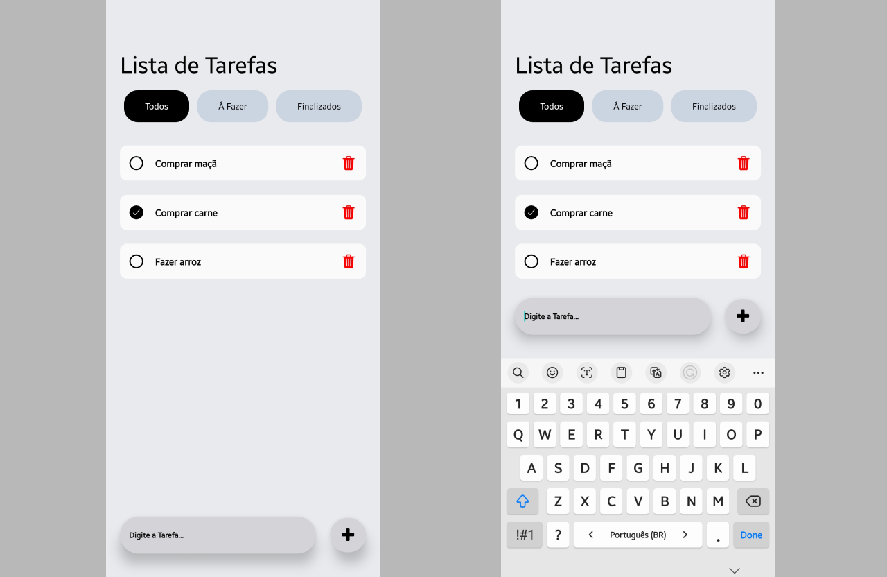

# To Do List App - With React Native 
A simple to-do list app. The development process is available on my YouTube channel. If you want to watch [click here](https://www.youtube.com/watch?v=UgNCM6sSLT8&list=PLC2TtO9GyLvQ76WzYA2vnh3FocgQVyggj). (Only in Turkish)

## Features

- You can add as many tasks as you want. The application can check whether the same task has been added. 
- You can complete the task by simply long tapping on the task cards. The design will change accordingly. You can also long tap the completed task to delete it from the list. 
- The community-developed [React Native Modal](https://github.com/react-native-modal/react-native-modal) package is used for the task insertion window. 

## Real Android Device ScreenShots

<div align="center">

</div>

## Installation

Clone this repository on your local machine.

```
git clone https://github.com/JulioAmaral007/ToDo-app.git
```

## Usage

Run the following commands in the project folder to install the project dependencies.

```
npm init
npm install
npm run start
```
These instructions will get a copy of the project up and running on your local machine for development and testing purposes.